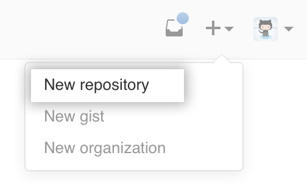
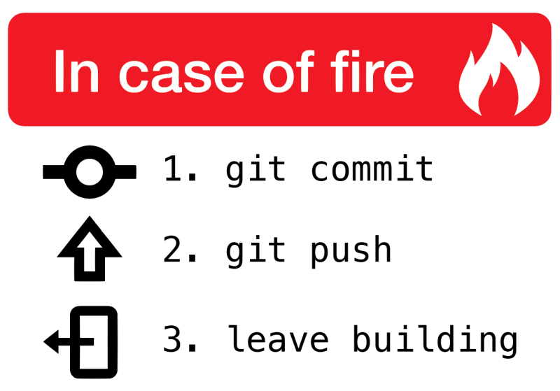

Podróże w czasie z GITem
========================


<!-- .element: style="width: 500px;" -->

---

O mnie
======


Paweł Grabarz

[Frizi @ GitHub](http://github.com/Frizi)

_Frontend Developer_

---

opowiem wam historię...

Note:
mamy super ważny projekt życia

----

```javascript
  // superprojekt.js
  function superProjekt() {
   return 'Hello, World!';
  }
```

----

Problem:

- Zmiany? lepiej nie, bo popsuję

Note:
boimy się ruszać

----

Rozwiązanie:


----

Problem:


Note:
branch, merge?

---

# Wersjonowanie

 jest git!
<!-- .element: style="height: 1em; vertical-align: middle; display: inline-block" -->

Note:
W gicie chodzi o kilka rzeczy.
1. śledzi historię wszystkich zmian w projekcie i możesz się cofnąć do dowolnego etapu rozwoju projektu.
Projekt to kod lub praca inżynierska, albo coś takiego, może design.
2. Kolaboracja! merge umożliwia wspólną pracę, lekki branch umożliwia nam eksperymentowanie z kodem bez stresu, że coś popsujemy.

----

otwieramy konsolę

`$ cd Projekty/projektzycia`
<!-- .element: class="fragment" -->


<!-- .element: class="fragment" -->

----

`$ git init`

Note:
**int** i co dalej?

----

`$ git commit -m"zaczynamy"`

```bash
nothing to commit

Untracked files:
    superprojekt.js
```
<!-- .element: class="fragment" style="width: 300px;" -->

Oops..
<!-- .element: class="fragment" -->

Note:
commit - zestaw zmian, wersja w czasie

----

> Commit wymaga przygotowania

`$ git add superprojekt.js`

```javascript
  // superprojekt.js
+ function superProjekt() {
+   return 'Hello, World!';
+ }
```
<!-- .element: class="fragment" -->

> (stage)

<!-- .element: class="fragment tree" -->


Note:
indeks - przygotowanie zmian do commita
It's a lot to take in, but for now you can think of commits as snapshots of the project. Commits are very lightweight and switching between them is wicked fast!

A commit in a git repository records a snapshot of all the files in your directory. It's like a giant copy and paste, but even better!

Git wants to keep commits as lightweight as possible though, so it doesn't just blindly copy the entire directory every time you commit. It can (when possible) compress a commit as a set of changes, or a "delta", from one version of the repository to the next.

Git also maintains a history of which commits were made when. That's why most commits have ancestor commits above them -- we designate this with arrows in our visualization. Maintaining history is great for everyone working on the project!


----

commit

`$ git commit -m"zaczynamy"`

> (stage)

<!-- .element: class="fragment fade-out absolute tree" data-fragment-index="1" -->

> C1

<!-- .element: class="fragment tree" data-fragment-index="1" -->


Note:
historia nabiera struktury

----

### \*note to self\*

<!-- .element: style="margin-bottom: 0;" -->

git commit **-m"trochę zmian"**

<!-- .element: class="fragment fade-out absolute" data-fragment-index="1" -->

~~git commit **-m"trochę zmian"**~~

<!-- .element: class="fragment" data-fragment-index="1" -->

git commit **-m"PZ-1 utworzenie pierwszego pliku"**

<!-- .element: class="fragment" data-fragment-index="1" -->

> Zostaw wiadomość dla siebie z przyszłości.

<!-- .element: class="fragment" data-fragment-index="1" -->

Note:
za 5 lat zapomnisz, co autor miał na myśli

----

## Zmiany, zmiany, zmiany

----

```javascript
  // superprojekt.js
  function superProjekt() {
-   return 'Hello, World!';
+   return 'Hello, Geek Girls Carrots!';
  }
```

```bash
git add superprojekt.js
git commit -m"GGC to mój świat"
```
<!-- .element: class="fragment" data-fragment-index="2" -->

> C1

<!-- .element: class="fragment fade-out absolute tree" data-fragment-index="2" -->

> C1 -> C2

<!-- .element: class="fragment tree" data-fragment-index="2" -->

Note:
**int** add, commit

ponownie add, bo dodajemy zmiany, a nie pliki

----

> C1 -> C2

<!-- .element: class="tree" -->


># C1
<!-- .element: class="qhalf" -->
># C2
<!-- .element: class="qhalf" -->
```javascript
  function superProjekt() {
    return 'Hello, World!';
  }
```
<!-- .element: class="qhalf pad" -->
```javascript
  function superProjekt() {
    return 'Hello, Geek Girls Carrots!';
  }
```
<!-- .element: class="qhalf pad" -->


<!-- .element: class="qflex" -->

Note:
zawsze możemy wrócić do dowolnego czasu

---

  <!-- .slide: data-background="timetravel.gif" data-background-transition="zoom" -->

## Podróże w czasie

<!-- .element: class="hw" -->

----

`$ git checkout C1`

<!-- .element: class="fragment fade-out absolute" data-fragment-index="1" -->

`$ git checkout C2`

<!-- .element: class="fragment" data-fragment-index="1" -->

> \*C1 ->  C2

<!-- .element: class="tree fragment fade-out absolute" data-fragment-index="1" -->

>  C1 -> \*C2

<!-- .element: class="tree fragment" data-fragment-index="1" -->

```javascript
  function superProjekt() {
    return 'Hello, World!';
  }
```
<!-- .element: class="fragment fade-out absolute" data-fragment-index="1" -->

```javascript
  function superProjekt() {
    return 'Hello, Geek Girls Carrots!';
  }
```
<!-- .element: class="fragment" data-fragment-index="1" -->

----

## nic nie popsujemy!


<!-- .element: style="width: 300px; animation: flips 1s steps(1) infinite" -->

----

## nazwy commitów nie są takie ładne

cb9defd36fd8ba1ce380211195bd44279b02264f

Note:
nie trzeba używać całej nazwy, wystarczy unikalny początek

---


<!-- .slide: data-background="rozdr.jpg" -->

# branch
<!-- .element: class="hw" -->

Note:
wyobraźcie sobie, że chcecie przetestować eksperymentalną zmianę

----

W sumie, to nic wielkiego.

<span>Taka o etykietka.</span>
<!-- .element: class="fragment" -->
<span>Ruchoma.</span>
<!-- .element: class="fragment" -->

----

`$ git checkout <branch>`

----

`master` - domyślny branch

----

<!-- .slide: data-transition="fade" -->
```javascript
  function superProjekt() {
    return 'Hello, World!';
  }
```
<!-- .element: class="fragment fade-out absolute" data-fragment-index="1" -->
```javascript
  function superProjekt() {
-   return 'Hello, World!';
+   return 'Hello, Geek Girls Carrots!';
  }
```
<!-- .element: class="fragment" data-fragment-index="1" -->

>&nbsp;,-\*master
     >C1

 <!-- .element: class="tree" -->
`git commit -m"C1"`
<!-- .element: class="fragment fade-out absolute" data-fragment-index="1" -->
`git add superprojekt.js`
<!-- .element: class="fragment" data-fragment-index="1" -->

Branch podąża za komendą `commit`.

Note:
pomijam **add** w tym tłumaczeniu.
Po prostu przed każdym commitem ma on być.

----

<!-- .slide: data-transition="fade" -->
```javascript
  function superProjekt() {
    return 'Hello, Geek Girls Carrots!';
  }
```
>&nbsp;      ,-\*master
     >C1 -> C2

 <!-- .element: class="tree" -->

`git commit -m"C2"`


Note:
tak na prawdę chcemy śledzić branche

----

<!-- .slide: data-transition="fade" -->
```javascript
  function superProjekt() {
    return 'Hello, Geek Girls Carrots!';
  }
```
<!-- .element: class="fragment fade-out absolute" data-fragment-index="1" -->
```javascript
  function superProjekt() {
-   return 'Hello, Geek Girls Carrots!';
+   return 'Hi, Geek Girls Carrots!';
  }
```
<!-- .element: class="fragment" data-fragment-index="1" -->
>&nbsp;      ,-master
     >C1 -> C2
>&nbsp;      \`-\*nowy

 <!-- .element: class="tree" -->

`git branch nowy`

`git checkout nowy`

Przestawiamy się na nowy branch <span>i wprowadzamy zmiany</span>
<!-- .element: class="fragment" data-fragment-index="1" -->

Note:
1. Tworzymy nową etykietę i przylepiamy ją do aktualnie wskazanego commita.
2. Zaczynamy ją śledzić.

----

<!-- .slide: data-transition="fade" -->
```javascript
  function superProjekt() {
    return 'Hi, Geek Girls Carrots!';
  }
```
>&nbsp;      ,-master
     >C1 -> C2
>&nbsp;      \`-\*nowy

 <!-- .element: class="tree" -->

`git commit -m"C3"`
<!-- .element: class="fragment" data-fragment-index="1" -->

Note:
master się nie zmienił

----

<!-- .slide: data-transition="fade" -->
```javascript
  function superProjekt() {
    return 'Hi, Geek Girls Carrots!';
  }
```
>&nbsp;      ,-master
     >C1 -> C2 -> C3
>&nbsp;            \`-\*nowy

 <!-- .element: class="tree" -->

`git commit -m"C3"`

Note:
master się nie zmienił

----

<!-- .slide: data-transition="fade" -->
```javascript
  function superProjekt() {
    return 'Hello, Geek Girls Carrots!';
  }
```
<!-- .element: class="fragment fade-out absolute" data-fragment-index="1" -->
```javascript
- function superProjekt() {
-   return 'Hello, Geek Girls Carrots!';
+ function superProjekt(kto) {
+   return 'Hello, ' + kto + '!';
  }
+ log(superProjekt('Geek Girls Carrots'));
```
<!-- .element: class="fragment" data-fragment-index="1" -->

>&nbsp;      ,-\*master
     >C1 -> C2 -> C3
>&nbsp;            \`-nowy

 <!-- .element: class="tree" -->

`git checkout master`
<!-- .element: class="fragment fade-out absolute" data-fragment-index="1" -->

`git commit -m"C4"`
<!-- .element: class="fragment" data-fragment-index="1" -->

Note:
dodajemy zmiany na innego brancha

----

<!-- .slide: data-transition="fade" data-transition-speed="fast" -->
```javascript
  function superProjekt(kto) {
    return 'Hello, ' + kto + '!';
  }
  log(superProjekt('Geek Girls Carrots'));
```
>&nbsp;            ,-\*master
>&nbsp;      ,--> C4
     >C1 -> C2 -> C3
>&nbsp;            \`-nowy

 <!-- .element: class="tree" -->

---

<!-- .slide: data-background="merge.jpg" -->

# merge

<!-- .element: class="hw" -->

#### czyli połączenie zmian
<!-- .element: class="hw fragment" -->

----

`$ git merge <branch>`

----


<!-- .slide: data-transition="fade" data-transition-speed="fast" -->
```javascript
  function superProjekt(kto) {
    return 'Hello, ' + kto + '!';
  }
  log(superProjekt('Geek Girls Carrots'));
```
<!-- .element: class="fragment fade-out absolute" data-fragment-index="2" -->
# ?
<!-- .element: class="fragment" data-fragment-index="2" -->

>&nbsp;            ,-\*master
>&nbsp;      ,--> C4
     >C1 -> C2 -> C3
>&nbsp;            \`-nowy

 <!-- .element: class="tree fragment fade-out absolute" data-fragment-index="1" -->

 >&nbsp;            ,-\*master
 >&nbsp;      ,--> C4 ->*
      >C1 -> C2 -> C3 --^
 >&nbsp;            \`-nowy

 <!-- .element: class="tree fragment" data-fragment-index="1" -->

`git merge nowy`
<!-- .element: class="fragment" data-fragment-index="1" -->

----

<!-- .slide: data-transition="slide" data-transition-speed="fast" -->

# C4 (master)
```javascript
  function superProjekt() {
-   return 'Hello, Geek Girls Carrots!';
+   return 'Hi, Geek Girls Carrots!';
  }
```

# +

# C3 (nowy)

```javascript
- function superProjekt() {
-   return 'Hello, Geek Girls Carrots!';
+ function superProjekt(kto) {
+   return 'Hello, ' + kto + '!';
  }
+ log(superProjekt('Geek Girls Carrots'));
```

----

<!-- .slide: data-transition="fade" data-transition-speed="fast" -->

<!-- .element: width="700px" -->

Note:
Merge może prowadzić do konfliktu,
często konflity są rozwiązywane automatycznie

----

# C3 + C4 =

- zmiana `Hello,` na `Hi,`
- wprowadzenie parametru `kto`

```javascript
  function superProjekt(kto) {
    return 'Hi, ' + kto + '!';
  }
  log(superProjekt('Geek Girls Carrots'));
```
<!-- .element: class="fragment" -->

Note:
zmiany mogą pochodzić od wielu kontrybutorów

----


<!-- .slide: data-transition="fade" data-transition-speed="fast" -->
```javascript
  function superProjekt(kto) {
    return 'Hi, ' + kto + '!';
  }
  log(superProjekt('Geek Girls Carrots'));
```
>&nbsp;            
>&nbsp;                  ,-\*master
     >C1 -> C2 -> C4 -> C5
>&nbsp;      \`--> C3 ---^
>&nbsp;            \`-nowy

 <!-- .element: class="tree" -->
 `C5` - **merge commit**


----


Note:
repozytorium git jest siecią powiązanych ze sobą historii zmian

---

<!-- .slide: data-background="del-pc.gif" class="hww" -->

Świat dzieli się na dwie grupy ludzi:

- ci, którzy robią backup,<!-- .element: class="fragment" -->
- ci, którzy będą robić backup.<!-- .element: class="fragment" -->

Note:
1. jak pies zje nam komputer
2. jak będzie powódź
3. jak będzie huragan


----

potrzebujemy backupu **z synchronizacją**
<!-- .element: class="fragment" data-fragment-index="1" -->

---

GitHub
======


<!-- .element: style="width: 500px;" -->

----

GitHub
======

Facebook dla programistów

Note:
tworzenie społeczności open-source

----

<!-- .slide: data-background="github-explore.png" -->

Note:
popularne repozytoria

----

<!-- .slide: data-background="github-react.png" -->

Note:
kolaboracja i przeglądanie kodu

----

<!-- .slide: data-background="github-contrib.png" -->

Note:
statystyki

----

<!-- .slide: data-background="github-pr.png" -->

Note:
Pull requesty

----

Gist
<iframe width="800px" height="500px" src="data:text/html;base64,PHNjcmlwdCBzcmM9Imh0dHBzOi8vZ2lzdC5naXRodWIuY29tL2pvb2t5Ym9pLzY2ODM5NjAuanM/ZmlsZT0zX2NoZWVzZWNha2VfcmVjaXBlLm1kIj48L3NjcmlwdD4="/>

---

Ok, [robimy repozytorium na GitHubie](https://help.github.com/articles/create-a-repo/)




----

`$ git remote add origin <ścieżka>`

<!-- .element: class="fragment fade-out absolute" data-fragment-index="1" style="width: 100%" -->

`$ git remote add origin https://github.com/AnnaKowalska/superprojekt.git`

<!-- .element: class="fragment" data-fragment-index="1" style="width: 140%; margin: 0 -20%;" -->

Note:
własna ścieżka

----


Note:
to samo może zrobić twoja koleżanka

---


<!-- .element: style="width: 50%;" -->


Note:
przykładów użycia jest dużo, narzędzie jest bardzo przydatne w praktyce

----

# Pytania?


<!-- .element: style="width: 50%;" -->


linki: <!-- .element: style="text-align: left; margin-top: 0px" -->
- [GitHub](https://github.com/)
- [tutorial Learn Git Branching](http://pcottle.github.io/learnGitBranching/)

<!-- .element: style="text-align: left; width: 100%;" -->
